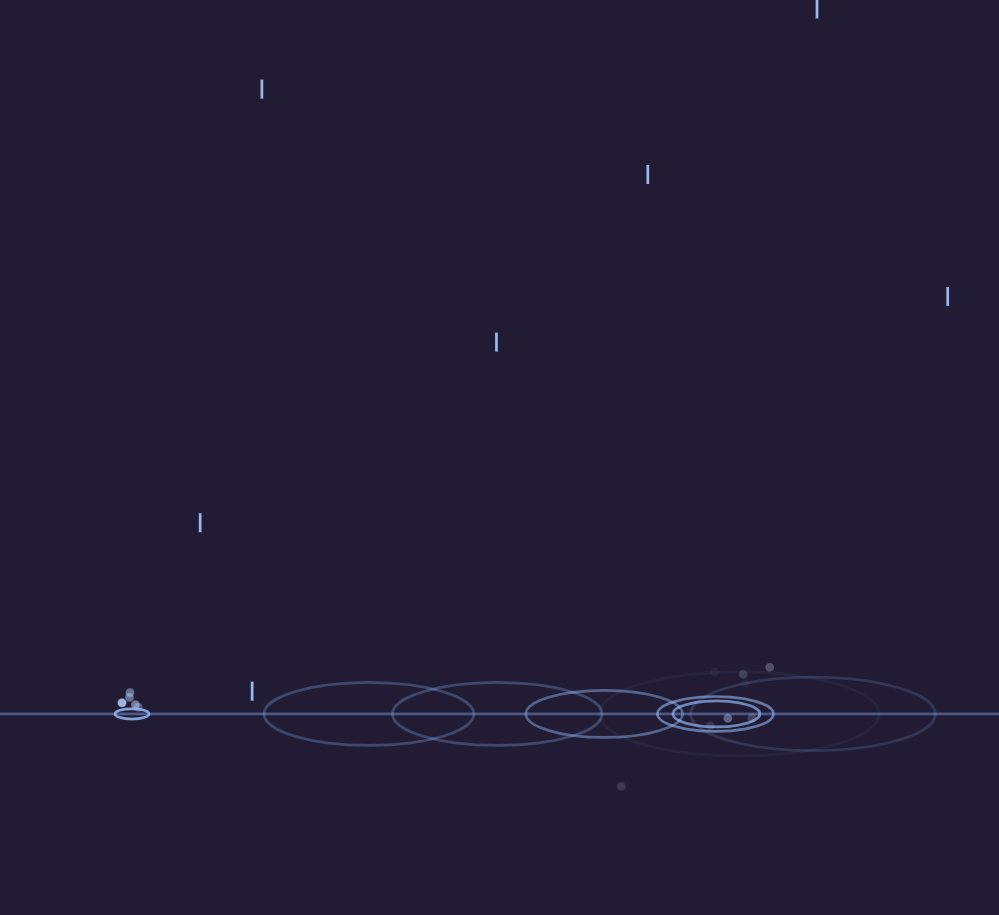

# Sparks & Sprites

**A plain-words study book of every common way to put images, backgrounds, movement, sound, and visual effects on screen *with code* — across Godot, Unity, Unreal, and the open web.**

Checked against **Godot 4.7 · Unity 6.3 LTS · Unreal 5.8 · the web (2026)**. The ideas are stable across versions; only menu names drift.

*Generated from [this prompt](PROMPT.md), with formatting cleaned up.*

All external links in this book were last checked on **26 August 2026** (UTC+7).

---

## Three promises

1. **No chapter assumes you remember any other chapter.** Every technical word is re-explained, in place, every time it matters. Re-reading a definition you've seen before is a feature of this book, not an insult to you.
2. **Nothing here can break anything.** This is a map, not a machine. Skimming, forgetting, and returning months later are all correct ways to use it.
3. **Show first, then tell.** Wherever a thing can be *seen*, there's a live demo where the code and its visual result sit side by side — and you can edit the code right there. (The style owes a debt to [saint11's pixel-art tutorials](https://saint11.art/blog/pixel-art-tutorials/), which teach by showing.)

*The [Waterdrops demo](https://esorhizome.github.io/sparks-and-sprites/waterdrops.html) mid-rain — in the gallery, this canvas sits beside its editable code: fall, splash, ripple.*

## How demos work here

- **Web + Godot get direct, runnable demos.**
  - Web: open any page in **[the live demo gallery](https://esorhizome.github.io/sparks-and-sprites/)** — each one shows editable code next to its visual result. Change a number, press *Run*, watch it change. No installs, no build step.
  - Godot: open [`demos/godot/`](demos/godot/) as a Godot 4.x project. **Every web demo has a Godot twin** — each builds its whole scene *from code* in `_ready()`, so the script **is** the demo — heavily commented, tweak and re-run. Each gallery page also links its `.gd` file directly, so you can download one demo without cloning anything.
- **Unity + Unreal get script templates + explained code.** Each chapter shows the equivalent Unity/Unreal code or editor recipe and explains *why* it produces the same result — and the repo now carries starter folders for both: [`demos/unity/`](demos/unity/) (a self-contained C# script per demo) and [`demos/unreal/`](demos/unreal/) (C++ actor templates for the code-natural demos, exact-value editor recipes for the Niagara/material ones — **each covering both Unreal 2D and 3D**: every recipe names its UMG/Paper2D spelling alongside the 3D one). Assets are being imported gradually; until then the scripts are working recipes, not committed projects. The concepts transfer one-to-one; only the syntax changes accent.

## The chapters

| # | Chapter | What it covers |
|---|---------|----------------|
| 00 | [How to read this book](chapters/00-how-to-read.md) | The promises, the entry anatomy, permission to skim |
| 01 | [First words](chapters/01-first-words.md) | The sixteen terms everything else is built from |
| 02 | [Images on screen](chapters/02-images-on-screen.md) | Load → attach → place, in four accents |
| 03 | [Combining VFX with sprites](chapters/03-combining-vfx-with-sprites.md) | Layer, tint, add, mask, outline, dissolve, relight |
| 04 | [Backgrounds](chapters/04-backgrounds.md) | Gradients, parallax, infinite scroll, noise skies |
| 05 | [Movement & personality](chapters/05-movement-and-personality.md) | Human, superhuman, alien, emotional, robot, stately — as code |
| 06 | [The VFX cookbook](chapters/06-vfx-cookbook.md) | Glow, flame, sparks, waterdrops, halo, metal & chrome, trails, shake |
| 07 | [Sound effects](chapters/07-sound-effects.md) | Playing, randomizing, and synthesizing sound from code |
| 08 | [Free & legal sources](chapters/08-free-and-legal-sources.md) | Where assets come from, and what each license asks |
| 09 | [Web export & browsers](chapters/09-web-export-and-browsers.md) | The six real failure modes, and testing Safari without a Mac |
| 10 | [If you freeze up](chapters/10-if-you-freeze-up.md) | The four-step un-freezing protocol |
| 11 | [three.js & Babylon.js](chapters/11-three-and-babylon.md) | 3D, 2D, and every hybrid in the browser — plus Node.js disentangled |
| 12 | [Responsive cursors & living buttons](chapters/12-cursors-and-living-buttons.md) | Glowing buttons, cursor trails, custom cursors — alive at rest, grateful when touched |
| 13 | [Text that moves](chapters/13-text-that-moves.md) | Programmatic text animation: typewriters, glows, scrambles, waves — the fourteen families |
| 14 | [Procedural animation & the maths of movement](chapters/14-procedural-animation.md) | Springs, steering, IK, verlet, gait — every movement recipe and its maths, in plain words |

## The cheatsheets

One-page quick references for the days you just need the answer:

- [Glossary](cheatsheets/glossary.md) — every term in the book, one line each
- [Images](cheatsheets/images.md) — load/attach/place across all four platforms
- [Movement](cheatsheets/movement.md) — the personality dials, easing names, spring numbers
- [VFX](cheatsheets/vfx.md) — effect → mechanism → engine pointer
- [Sound](cheatsheets/sound.md) — play, randomize, synthesize
- [Backgrounds](cheatsheets/backgrounds.md) — the five background patterns
- [Text](cheatsheets/text.md) — the per-letter anatomy, family → mechanism, the numbers that keep working
- [Procedural animation](cheatsheets/procedural-animation.md) — the A–Z of movement maths, the four load-bearing snippets, enemy brains cheapest-first
- [Browsers](cheatsheets/browsers.md) — the pre-release checklist + engine families
- [Licenses & sources](cheatsheets/licenses-and-sources.md) — the source table + license glossary
- [Node vs three vs Babylon](cheatsheets/three-vs-babylon.md) — the three names, modes of use, genre recipes

## Licensing of this repo

- Prose (chapters, cheatsheets): **CC-BY 4.0** — reuse freely with credit; full legal text in [LICENSE](LICENSE).
- Code (demos, snippets): **MIT** — see [LICENSE-CODE](LICENSE-CODE).

## Running the Godot demos

1. Install [Godot 4.x](https://godotengine.org/) (free, ~100 MB, no account needed).
2. Open Godot → *Import* → choose `demos/godot/project.godot`.
3. Press **F5**. A menu scene lists every demo — click one (or press its key); **Esc** returns to the menu.
